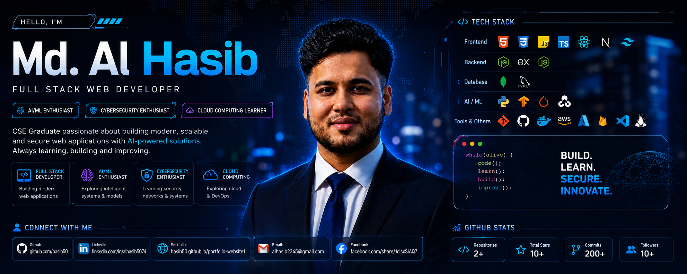

<!-- ===================== HEADER ===================== -->

<div align="center">



</div>

<br/>

<div align="center">


<br/>


<br/><br/>


</div>

---

# 👨‍💻 About Me

Hi! I'm **Md. Al Hasib**, a CSE graduate and aspiring software engineer from Bangladesh.

I'm currently focusing on **Full-Stack Web Development**, while building deeper expertise in **Artificial Intelligence, Machine Learning, Cybersecurity, and Cloud Computing**.

- 🎓 BSc in Computer Science & Engineering
- 🏫 Daffodil International University
- 💻 Full-Stack Web Development — **Primary Focus**
- 🤖 AI & Machine Learning — **Main Interest**
- 🛡️ Cybersecurity — **Strong Interest**
- ☁️ Cloud Computing — **Supporting Area**
- 📚 Currently learning through Programming Hero
- 🚀 Building projects and improving problem-solving skills
- 🎯 Goal: Become a strong software engineer with expertise in AI-powered applications

---

# 🚀 My Current Focus

| Area | Focus |
|---|---|
| 💻 Full-Stack Development | ⭐ Primary |
| 🤖 AI & Machine Learning | 🔥 Main Interest |
| 🛡️ Cybersecurity | 🔥 Strong Interest |
| ☁️ Cloud Computing | 📚 Supporting Area |

---

# 🛠️ Tech Stack

### 👨‍💻 Programming Languages

<p align="center">


</p>

### 🌐 Full-Stack Development

<p align="center">


</p>

<p align="center">


</p>

### 🗄️ Database

<p align="center">


</p>

### 🤖 AI & Machine Learning

<p align="center">


</p>

<p align="center">


</p>

### 🛡️ Cybersecurity & Systems

<p align="center">


</p>

<p align="center">


</p>

### ☁️ Cloud & DevOps

<p align="center">


</p>

### 🎨 UI & Payment

<p align="center">


</p>

---

# 📚 Currently Learning

<p align="center">


</p>

---

# 🚀 Featured Projects

<div align="center">

## 🤟 Real-Time Sign Language Detection
### 🎓 AI/ML Research & Thesis Project

An AI-powered **real-time sign language detection system** using Computer Vision and YOLO-based object detection to recognize sign language gestures from live video.

<br/>


</div>

### 🎯 Project Overview

**Real-Time Sign Language Detection** is an AI/ML research project focused on detecting and recognizing sign language gestures from real-time video.

The system uses **YOLO-based object detection**, Computer Vision and Deep Learning techniques to process video frames and identify sign language gestures in real time.

The project explores how AI-powered vision systems can contribute to more accessible and intelligent communication solutions.

### ✨ Key Features

- 🤟 Real-time sign language gesture detection
- 🎥 Live video input processing
- 🎯 YOLO-based object detection
- 👁️ Computer Vision with OpenCV
- 🧠 Deep Learning-based recognition
- 📊 Dataset preparation and preprocessing
- ⚡ Real-time prediction pipeline
- 🔍 Gesture detection and classification
- 🚀 Accessibility-focused AI application

### 🧠 ML Pipeline

Live Video
     ↓
Frame Extraction
     ↓
Image Preprocessing
     ↓
YOLO Detection
     ↓
Gesture Recognition
     ↓
Real-Time Prediction
🛠️ Technologies
<p align="center">  </p> <p align="center">      </p>
📌 Project Details
Component	Details
🎓 Project Type	AI/ML Research & Thesis
🤖 AI Domain	Computer Vision
🎯 Detection Model	YOLO
🎥 Input	Real-Time Video
🧠 Core Technology	Deep Learning
👁️ Vision Library	OpenCV
🐍 Programming	Python
📊 Data Processing	NumPy • Pandas
🚀 Goal	Real-Time Sign Language Detection

🔬 Status: Research / Development in Progress

🐾 Pawsitive — A Sweet Home For Every Pet

A modern pet adoption and management platform designed to help pets find loving homes while providing users with an easy and engaging way to discover and adopt pets.

🎯 Project Overview

Pawsitive is a web-based platform built around the idea that every pet deserves a loving home.

The application provides an intuitive interface where users can explore available pets, view pet information and connect with the adoption process.

✨ Key Features
🐶 Pet adoption platform
🐱 Browse available pets
🔎 Pet search and discovery
📋 Detailed pet information
❤️ Adoption-focused user experience
📱 Responsive and modern UI
🔌 API-based data integration
🎨 Clean and user-friendly design
🛠️ Technologies
<p align="center">  </p> <p align="center">     </p>
📌 Project Highlights
Component	Details
🐾 Project Type	Pet Adoption Platform
🌐 Application	Web Application
🎨 Focus	UI/UX & User Experience
🔎 Core Feature	Pet Discovery & Adoption
📱 Design	Responsive
🔌 Integration	REST API
❤️ Purpose	Helping Pets Find Loving Homes
🤖 AI & Machine Learning Projects

Exploring practical Artificial Intelligence and Machine Learning solutions focused on computer vision, data analysis, prediction and intelligent applications.

Areas of Interest
🧠 Machine Learning
👁️ Computer Vision
🤖 Deep Learning
📊 Data Analysis
🎯 Object Detection
🔮 Predictive Modeling
⚡ AI-powered Applications

Tech: Python • TensorFlow • PyTorch • OpenCV • NumPy • Pandas

🔐 Cybersecurity Projects

Exploring cybersecurity and system security through practical learning and experimentation.

Areas of Interest
🌐 Networking
🐧 Linux & System Security
🔐 Web Security
🛡️ Cybersecurity Fundamentals
🔎 Security Testing
⚙️ Secure Application Development
<div align="center"> <a href="https://github.com/hasib50?tab=repositories">  </a> </div> ```

---

## 🧭 Full-Stack Engineering Roadmap & Progression

| Domain / Milestone | Core Technologies & Focus Areas | Progression | Status |
|:---|:---|:---:|:---:|
| **Web Fundamentals & UI** | HTML5, CSS3, Responsive Design, Tailwind CSS, DOM & BOM | `██████████ 100%` |  |
| **JavaScript & Modern Web** | ES6+, Array Methods, DOM, Async/Await, Fetch API, API Integration | `████████░░ 80%` |  |
| **React & Frontend Architecture** | React, Components, Hooks, React Router, Forms, State Management | `███████░░░ 70%` |  |
| **Backend & REST APIs** | Node.js, Express.js, REST API, Middleware, Authentication | `█████░░░░░ 50%` |  |
| **Database & Data Layer** | MongoDB, MySQL, CRUD, Database Design & Data Modeling | `█████░░░░░ 50%` |  |
| **Authentication & Security** | Firebase Auth, JWT, Networking, Linux, Web Security | `████░░░░░░ 40%` |  |
| **Full-Stack Applications** | MERN Stack, API Integration, AI Integration, Stripe | `████░░░░░░ 40%` |  |
| **Next-Gen Web Architecture** | Next.js, TypeScript, SSR, Modern Web Architecture | `███░░░░░░░ 30%` |  |
| **Cloud & DevOps** | AWS, Azure, Firebase, Docker, Deployment & CI/CD | `███░░░░░░░ 30%` |  |

<details>
<summary><b>🔍 View Detailed Learning Progression & Topics</b></summary>

<br/>

### Phase 1: Web Fundamentals & UI Architecture

- [x] Semantic HTML5 & Modern Page Structure
- [x] CSS3 Fundamentals
- [x] Flexbox & CSS Grid
- [x] Responsive Web Design
- [x] Tailwind CSS
- [x] DOM & BOM
- [x] Git & GitHub Fundamentals

### Phase 2: JavaScript & Modern Web Development

- [x] JavaScript Fundamentals
- [x] ES6+ Syntax
- [x] Functions, Scope & Closures
- [x] Array Methods — `map`, `filter`, `reduce`, `find`
- [x] DOM Manipulation
- [x] Event Handling
- [x] Async/Await
- [x] Promises
- [x] Fetch API
- [x] REST API Integration
- [ ] Advanced JavaScript Architecture

### Phase 3: React & Frontend Engineering — Active Focus

- [x] React Components & JSX
- [x] Props & Component Communication
- [x] `useState` & `useEffect`
- [x] React Router
- [x] Form Handling
- [x] API Integration
- [ ] Advanced React Patterns
- [ ] Global State Management
- [ ] TanStack Query
- [ ] Performance Optimization

### Phase 4: Backend & Database Engineering — Active Focus

- [x] Node.js Fundamentals
- [x] NPM Ecosystem
- [ ] Express.js Architecture
- [ ] RESTful API Development
- [ ] Custom Middleware
- [ ] MongoDB Database Design
- [ ] MySQL Database Management
- [ ] CRUD Operations
- [ ] Advanced Data Modeling
- [ ] API Error Handling

### Phase 5: Authentication & Secure Applications

- [x] Basic Web Security Concepts
- [x] Networking Fundamentals
- [x] Linux Fundamentals
- [ ] Firebase Authentication
- [ ] JWT Authentication
- [ ] Role-Based Access Control
- [ ] Secure API Development
- [ ] OWASP Web Security Fundamentals

### Phase 6: AI-Powered Full-Stack Development

- [x] Python for AI/ML
- [x] NumPy & Pandas
- [x] OpenCV
- [x] TensorFlow
- [x] PyTorch
- [x] Computer Vision Fundamentals
- [ ] AI API Integration
- [ ] AI-Powered Web Applications
- [ ] Production AI Integration

### Phase 7: Production & Cloud Engineering

- [ ] Next.js
- [ ] TypeScript
- [ ] Docker
- [ ] AWS
- [ ] Azure
- [ ] CI/CD Pipelines
- [ ] Production Deployment
- [ ] Scalable Cloud Architecture

</details>

---

## 🚀 Featured Repositories

| Repository | Description | Stack | Link |
|:---|:---|:---|:---:|
| **Real-Time-Sign-Language-Detection** | AI-powered real-time sign language detection using Computer Vision and YOLO | `Python` `OpenCV` `YOLO` | [Repository →](https://github.com/hasib50) |
| **Pawsitive** | Modern pet adoption and management platform with responsive UI and API integration | `React` `JavaScript` `Tailwind CSS` | [Repository →](https://github.com/hasib50) |
| **More Projects** | More web development, AI/ML and software engineering projects | `Full-Stack` `AI/ML` | [View All →](https://github.com/hasib50?tab=repositories) |

---


---

# 📊 GitHub Stats

<div align="center">

<!-- GitHub Stats + Most Used Languages -->

<table>
<tr>

<td width="50%" align="center">


</td>

<td width="50%" align="center">


</td>

</tr>
</table>

<br/>

<!-- GitHub Streak -->


</div>

---

# 📈 GitHub Contribution Activity

<div align="center">


</div>

---

# 🏆 GitHub Trophies

<div align="center">


</div>

---

# 🐍 Contribution Snake

<div align="center">


</div>

---

# 📌 GitHub Profile Summary

<div align="center">


</div>

---

---

# 🌐 Connect With Me

<div align="center">

<a href="https://www.linkedin.com/in/alhasib5074">

</a>

<a href="https://www.facebook.com/share/1cisxSiAQ7/">

</a>

<a href="https://hasib50.github.io/portfolio-website1/">

</a>

<a href="mailto:alhasib2345@gmail.com">

</a>

</div>

---

# 🧠 Developer Mindset

<div align="center">

### “Build. Learn. Secure. Innovate.”

**Turning ideas into scalable software and intelligent solutions.**

</div>

---

<div align="center">


</div>
